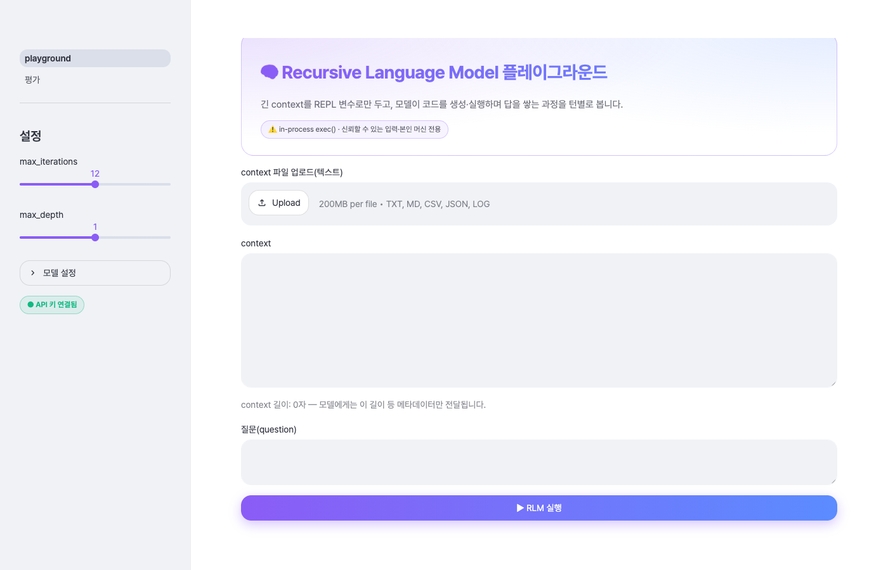
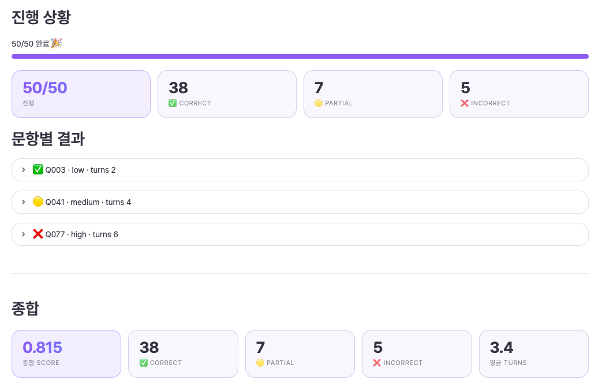

# mini-rlm

긴 문서를 통째로 모델에 넣는 대신, **모델이 코드를 써서 그 문서를 탐색하게** 하면 어떨까?
RAG처럼 미리 잘라 검색해 두는 방식과는 다른 이 접근이 실제로 통하는지 직접 돌려보고 정확도까지
재보려는 학습용 토이다. 

논문 *"Recursive Language Models"*(arXiv:2512.24601, 원본
repo: alexzhang13/rlm)의 핵심 메커니즘을 LangGraph로 최소한으로 재현했다.



## RLM이 뭔가

LLM은 컨텍스트가 길어질수록 비싸지고 정확도도 떨어진다. **Recursive Language Model(RLM)**은
긴 입력을 한 번에 읽는 대신, 그것을 **모델이 코드로 뒤지는 환경**으로 바꾼다.

입력은 Python REPL의 `context` 변수로만 존재한다. 모델에게 가는 메시지에는 본문이 아니라
글자 수 같은 메타데이터만 담긴다. 모델은 코드를 생성해 `context`를 슬라이싱·검색하고, 필요한
조각을 다른 LLM 호출(`llm_query`)이나 **자기 자신의 재귀 인스턴스**(`rlm_query`)에 넘겨
처리한 뒤 결과만 모아 답을 쌓아 올린다. 부분 문제를 또 다른 모델 호출로 푼다는 데서
"재귀(recursive)"라는 이름이 왔다.

## 빠른 시작

```bash
python3.10 -m venv .venv && source .venv/bin/activate   # Python 3.10+
pip install -r requirements.txt
export OPENROUTER_API_KEY=...        # 필수 (openrouter.ai/keys)

streamlit run app/playground.py      # 웹앱 (플레이그라운드 + 평가 페이지)
pytest -v                            # 테스트 — 네트워크·키 불필요 (가짜 모델)
```

웹앱은 두 페이지로 나뉜다.

- **플레이그라운드** — 아무 문서나 붙여넣고 질문하면, 모델이 그 문서를 `context`로 두고
  코드를 생성·실행하며 답을 찾아가는 과정을 턴별로 보여준다.
- **평가 페이지** — `data/`에 준비된 QA 테스트셋(삼성 2023 사업보고서 기반)을 난이도별로
  골라 라이브로 돌리고, LLM 채점자가 정답과 대조해 매긴 정확도를 집계로 보여준다.
  같은 평가는 CLI로도 돌릴 수 있다: `python -m eval --set single --n 10`.



## 어떻게 도는가

한 번의 실행은 네 조각으로 이뤄진다.

1. **컨텍스트는 핸들로만**

   거대 입력은 REPL 변수 `context`에만 있고, 모델 메시지엔
   메타데이터만 간다. 본문이 프롬프트로 새지 않는지는 테스트가 검증한다.
3. **코드로 다룬다**

   모델이 ```` ```repl ```` 블록을 생성하면 실행하고, 그 stdout만
   되돌려준다. 모델은 그걸 보고 다음 코드를 정한다.
6. **재귀 sub-call**

   `llm_query`로 조각을 위임하거나, `rlm_query`로 depth+1 재귀
   호출한다(깊이 한도를 넘으면 단순 위임으로 폴백).
8. **축약과 종료**

   REPL 출력은 8K자로 축약하고, 모델이 `answer["ready"] = True`를
   세팅하면 그 답을 최종 제출로 본다.
